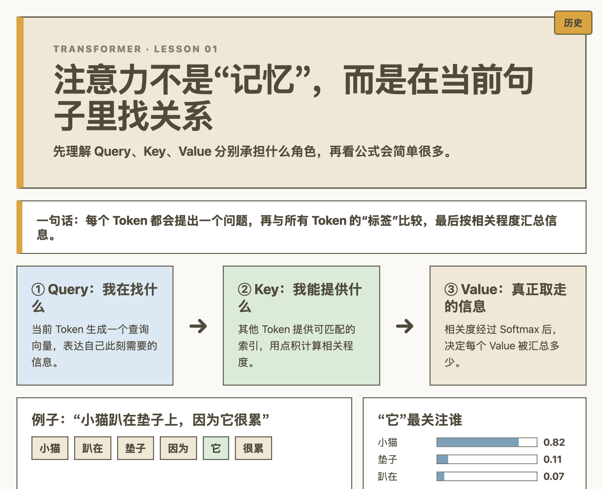
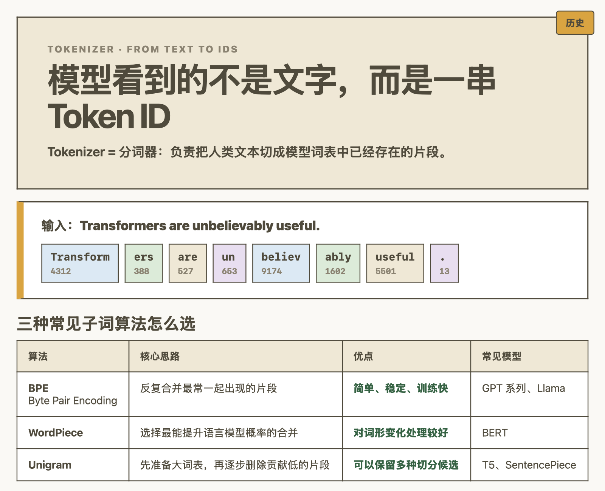
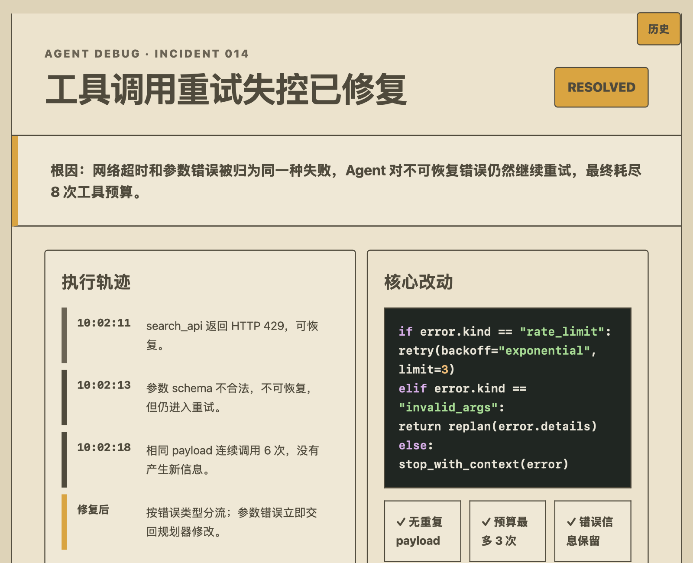

[skill网页](https://michel-johnson.github.io/HTML-Skill/)

# Codex HTML Reply

按用户明确要求，把 Codex 的当前回复写入独立、可刷新、带历史记录的 HTML 页面。默认回复保持普通聊天格式；Codex 只在明确调用 `$html-reply` 或要求 HTML 时写正文片段，再由 `publish.py` 负责归档、套模板、历史更新和校验。

每次回复会同时提供两个入口：`历史总览` 是当前 Session 的可搜索目录，可按标题、问题关键词或时间跳转到全部记录；`当前回复` 使用固定路径，刷新即可看到最新答案。HTML Reply 管理的持久 HTML、历史、状态和资产默认统一保存在用户级数据目录，不写入项目仓库。

页面也可以直接向用户提问：单选、复选、下拉选择会在改动后导出回答，文本回答会在离开输入框时导出；不需要启动 localhost 服务。由于当前版本默认不注册自动 Hook，回答文件不会在下一回合被隐式读取。

同一文件夹中的不同 Codex thread 使用进程自带的 `CODEX_THREAD_ID` 隔离回复、历史和状态文件；不同项目先按规范化绝对路径生成稳定哈希，再按 thread 分目录。发布工具会拒绝与当前 thread 不一致的旧 ID，而不是相信浏览器地址、历史页面或脚本中写死的路径。如果身份缺失，会直接阻止写入，不会退化成所有 thread 共用的 `local` 文件。

`publish.py --root <workspace>` 中的 `--root` 只用于识别项目、生成工作区哈希和解析项目内相对资源，不是输出目录。可以用 `--data-dir <path>` 显式指定数据目录；未指定时按以下顺序解析：

1. `$HTML_REPLY_DATA_DIR`
2. `$CODEX_HOME/html-reply`
3. `~/.codex/html-reply`

持久数据结构如下：

```text
<data-root>/workspaces/<workspace-hash>/threads/<CODEX_THREAD_ID>/
├── reply-<CODEX_THREAD_ID>.html
├── history-<CODEX_THREAD_ID>.html
├── archive/
├── assets/
└── session.json
```

数据目录只要位于当前项目、项目所属 Git 工作树或任何其他 Git 工作树内，Publisher 就会直接拒绝。外部目录无写权限时也会明确报错，不会回退到仓库内。

工作区哈希来自规范化后的绝对路径；项目移动或换到另一份 clone/worktree 后会形成新的历史分组，不会与旧路径下的记录自动合并。

安装器会把旧版本备份移出 `~/.agents/skills` 和 `$CODEX_HOME/skills`，避免多个同名 Skill 同时被 Codex 发现；发布工具会核验 `CODEX_THREAD_ID`，拒绝当前 thread 发布到其他 thread 的页面。


[查看完整 HTML 预览](docs/readme-preview.html)

## 不同任务的实际效果

这些示例均为本仓库单独生成的演示任务，不复用已有回复页面。

### Transformer 学习

[](docs/examples/transformer-learning.html)

### Tokenizer 学习

[](docs/examples/tokenizer-learning.html)

### Agent 调试报告

[](docs/examples/agent-debug-report.html)

## 安装

要求：Codex 与 Python 3.9+。

macOS：

```bash
curl -fsSL https://raw.githubusercontent.com/Michel-Johnson/HTML-Skill/main/install.py | python3 -
```

Windows PowerShell：

```powershell
irm https://raw.githubusercontent.com/Michel-Johnson/HTML-Skill/main/install.py | py -3
```

如果 Windows 没有 `py` 启动器，但 `python` 命令可用：

```powershell
irm https://raw.githubusercontent.com/Michel-Johnson/HTML-Skill/main/install.py | python -
```

安装完成后重启 Codex，或新建一个 session。

## 安装器会做什么

- 将 Skill 安装到官方用户级目录 `~/.agents/skills/html-reply`。
- 清理 `$CODEX_HOME/hooks.json` 中旧版 HTML Reply 自动 Hook，不影响其他 Hook。
- 将一小段全局规则写入 `$CODEX_HOME/AGENTS.md`，不会删除原内容。
- HTML Reply 设置为显式调用，安装器不会注册自动 Hook；Codex Desktop、CLI 与 IDE 默认都保持普通文本回复。
- 旧 task 若缓存了历史 HTML Hook 命令，会调用无条件放行的兼容脚本，不会继续强制生成 HTML。
- 不再注册强制 Stop Hook。旧 task 若缓存了历史 Stop 命令，会调用一个无条件放行的兼容脚本，不再出现开发复盘、`喵喵喵` 或结束阻断。
- 修改已有文件前自动创建带时间戳的备份。
- 重复运行是安全的：不会重复安装 Skill，也不会残留 HTML Reply 自动 Hook。
- 将 `CODEX_THREAD_ID` 作为最终发布身份；即使模型复制了旧 session 路径，发布工具也会拒绝串页。
- 持久 HTML 数据不会安装到 Skill 目录，也不会在卸载时被删除。

`CODEX_HOME` 未设置时默认为 `~/.codex`。

## 发布路径

先让 Publisher 返回当前 task 的临时草稿与外部输出路径：

```bash
python3 skill/html-reply/scripts/publish.py --root "/path/to/workspace" --paths
```

将正文 fragment 写入返回 JSON 的 `draft` 路径，并把当前用户请求（不含自动附加的界面上下文）写入 `promptFile`，再运行一次不带 `--paths` 的发布命令。不要把可能含凭据的 Prompt 放到命令行参数中。两个输入都位于系统临时目录，不是持久历史；发布成功后会自动删除。Publisher 只持久化脱敏后的 Prompt 预览。`reply`、`history`、`archive`、`assets` 和状态文件始终位于外部数据目录。

## 迁移旧版仓库内记录

旧版 `output/` 不会被自动删除。需要迁移时，按 thread 显式运行：

```bash
python3 skill/html-reply/scripts/reply_history.py migrate --root "/path/to/workspace" --session "<thread-id>"
```

在当前 Codex task 内可省略 `--session`，工具会使用 `CODEX_THREAD_ID`。迁移只复制旧的稳定回复和归档到外部目录，不覆盖已有外部记录，也不删除旧 `output/`；确认新页面无误后，再由用户自行处理旧文件。

如果来源是最早期共享文件 `output/reply.html`，使用 `migrate-shared` 将它导入当前合法 thread：

```bash
python3 skill/html-reply/scripts/reply_history.py migrate-shared --root "/path/to/workspace" --session "<target-thread-id>"
```

该命令只改变迁移来源，不会重新允许 `legacy` 或共享文件作为发布身份。

## 验证

```bash
python3 install.py --check
```

Windows：

```powershell
py -3 install.py --check
```

## 卸载

```bash
python3 install.py --uninstall
```

卸载只删除 HTML Reply 管理的 Skill、Hook 和全局规则，其他 Codex 配置保持不变。用户级 HTML 历史数据与仓库中尚未迁移或已迁移的旧 `output/` 都会保留。

## 兼容性

- macOS：使用系统或用户安装的 Python 3.9+。
- Windows 10/11：支持 `py -3` 或 `python`，路径包含空格时也能正确安装。
- 安装位置遵循 Codex 用户级 Skill 目录；如果检测到旧的 `$CODEX_HOME/skills/html-reply`，会先备份再迁移，并保留仅含 Hook 转发脚本的兼容目录，避免正在运行的旧 session 中断。
- 当前只配置 Codex，不修改其他 Agent 或编辑器。
- Desktop、CLI 与 IDE 默认都不自动调用该 Skill；只有用户当前消息明确要求 HTML 时才会启用。
- 页面交互会通过浏览器下载 `html-reply-response-<session-id>.json`，但当前显式调用版本不会自动读取该文件；它不属于 Publisher 管理的项目输出。

官方依据：[Build skills](https://learn.chatgpt.com/docs/build-skills) · [Codex Hooks](https://learn.chatgpt.com/docs/hooks)

## 本地安装

克隆仓库后运行：

```bash
python3 install.py
```

维护者回归测试与本地 Codex 上下文不随公开仓库和安装包分发。
