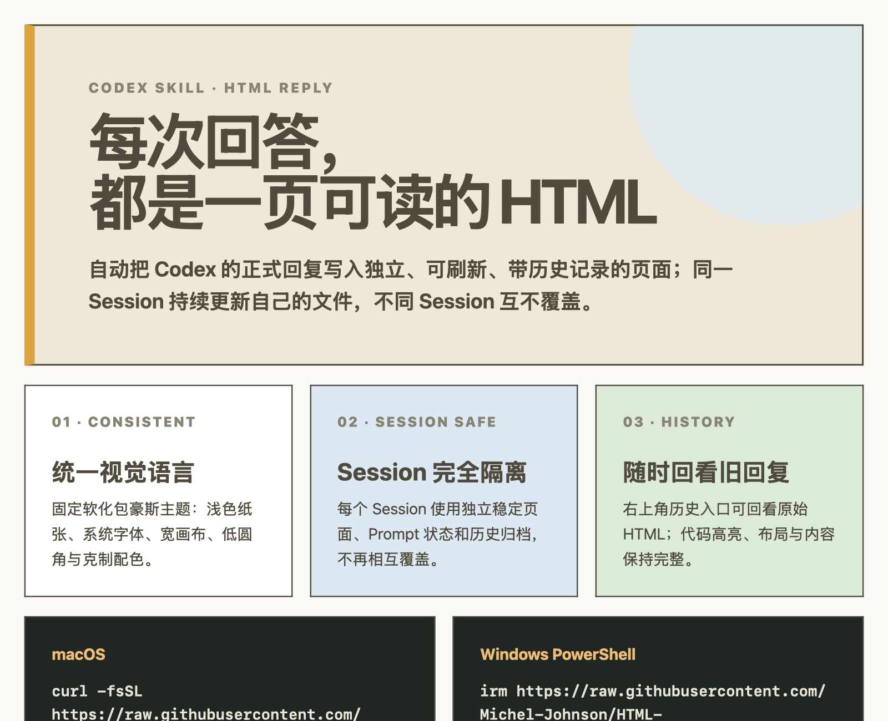

# Codex HTML Reply

让 Codex 的每次正式回复自动写入独立、可刷新、带历史记录的 HTML 页面。



[查看完整 HTML 预览](docs/readme-preview.html)

## 安装

要求：Codex 与 Python 3.9+。

macOS：

```bash
curl -fsSL https://raw.githubusercontent.com/Michel-Johnson/HTML-Skill/main/install.py | python3 -
```

Windows PowerShell：

```powershell
irm https://raw.githubusercontent.com/Michel-Johnson/HTML-Skill/main/install.py | py -3
```

如果 Windows 没有 `py` 启动器，但 `python` 命令可用：

```powershell
irm https://raw.githubusercontent.com/Michel-Johnson/HTML-Skill/main/install.py | python -
```

安装完成后重启 Codex，或新建一个 session。

## 安装器会做什么

- 将 Skill 安装到官方用户级目录 `~/.agents/skills/html-reply`。
- 将 HTML Reply Hook 合并进 `$CODEX_HOME/hooks.json`，不会覆盖已有 Hook。
- 将一小段全局规则写入 `$CODEX_HOME/AGENTS.md`，不会删除原内容。
- 修改已有文件前自动创建带时间戳的备份。
- 重复运行是安全的：每个 Hook 事件始终只保留一份 HTML Reply 配置。

`CODEX_HOME` 未设置时默认为 `~/.codex`。

## 验证

```bash
python3 install.py --check
```

Windows：

```powershell
py -3 install.py --check
```

## 卸载

```bash
python3 install.py --uninstall
```

卸载只删除 HTML Reply 管理的 Skill、Hook 和全局规则，其他 Codex 配置保持不变。

## 兼容性

- macOS：使用系统或用户安装的 Python 3.9+。
- Windows 10/11：支持 `py -3` 或 `python`，路径包含空格时也能正确安装。
- 安装位置遵循 Codex 用户级 Skill 目录；如果检测到旧的 `$CODEX_HOME/skills/html-reply`，会先备份再迁移，并保留仅含 Hook 转发脚本的兼容目录，避免正在运行的旧 session 中断。
- 当前只配置 Codex，不修改其他 Agent 或编辑器。

官方依据：[Build skills](https://learn.chatgpt.com/docs/build-skills) · [Codex Hooks](https://learn.chatgpt.com/docs/hooks)

## 本地安装

克隆仓库后运行：

```bash
python3 install.py
```

测试：

```bash
python3 -m unittest discover -s tests -v
```
